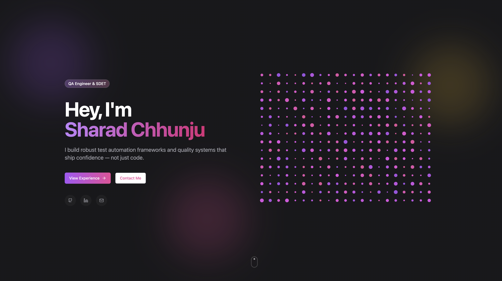

# Sharad Chhunju — Personal Portfolio

A modern, responsive personal portfolio for Sharad Chhunju, QA Engineer & SDET. Built with Next.js, Tailwind CSS, and deployed via GitHub Actions to GitHub Pages.



## Live Demo

[https://schhunju.github.io/](https://schhunju.github.io/)

## Features

- Responsive design that works on all devices
- Modern UI with smooth animations and a floating navigation bar
- Work experience timeline
- Skills showcase
- Contact section
- Deployed automatically via GitHub Actions on every push to `main`

## Technologies Used

- [Next.js](https://nextjs.org/) - React framework for production
- [Tailwind CSS](https://tailwindcss.com/) - Utility-first CSS framework
- [TypeScript](https://www.typescriptlang.org/) - Type-safe JavaScript
- [GitHub Actions](https://github.com/features/actions) - CI/CD and deployment
- [GitHub Pages](https://pages.github.com/) - Hosting platform

## Getting Started

To run this project locally:

1. Clone the repository:
   ```bash
   git clone https://github.com/schhunju/schhunju.github.io.git
   ```

2. Navigate to the project directory:
   ```bash
   cd schhunju.github.io
   ```

3. Install dependencies:
   ```bash
   npm install
   ```

4. Run the development server:
   ```bash
   npm run dev
   ```

5. Open [http://localhost:3000](http://localhost:3000) in your browser.

## Deployment

This project is deployed automatically to GitHub Pages using GitHub Actions. On every push to the `main` branch, the workflow:

1. Builds the Next.js app as a static export (`next build`)
2. Uploads the `out/` directory as a GitHub Pages artifact
3. Deploys it to [https://schhunju.github.io/](https://schhunju.github.io/)

The workflow configuration lives in [`.github/workflows/deploy.yml`](./.github/workflows/deploy.yml).

## Customization

To adapt this portfolio for your own use:

1. Update personal info in `data/profile.ts`
2. Update work experience in `data/experience.ts`
3. Modify page content and sections in `app/page.tsx`
4. Replace images in the `public/` folder
5. Adjust the color scheme in `tailwind.config.ts`

## License

This project is open source and available under the [MIT License](./LICENSE).
